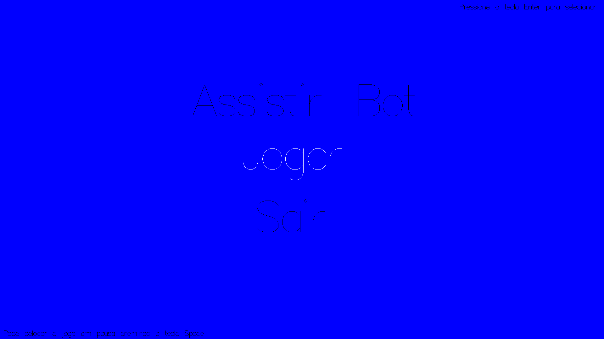
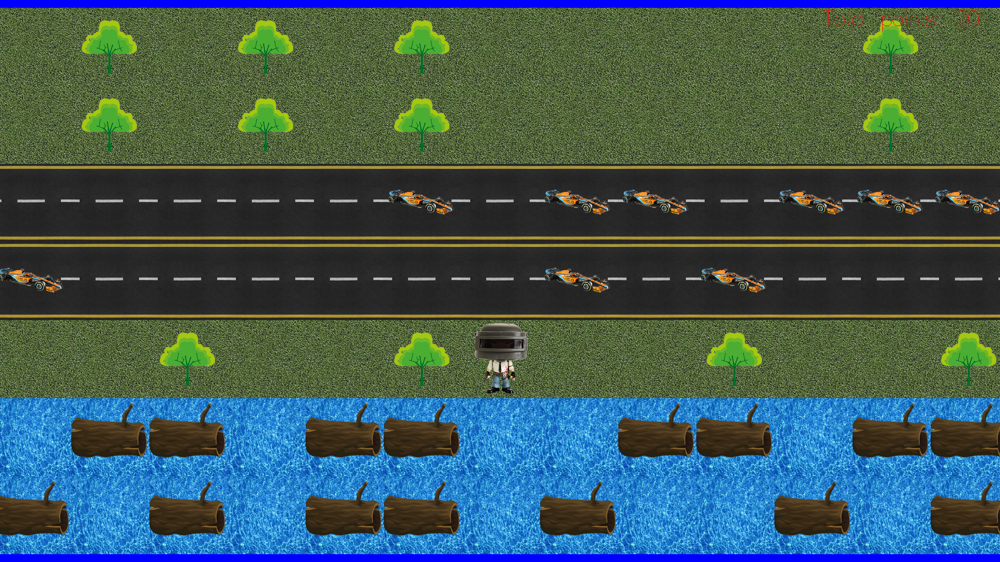
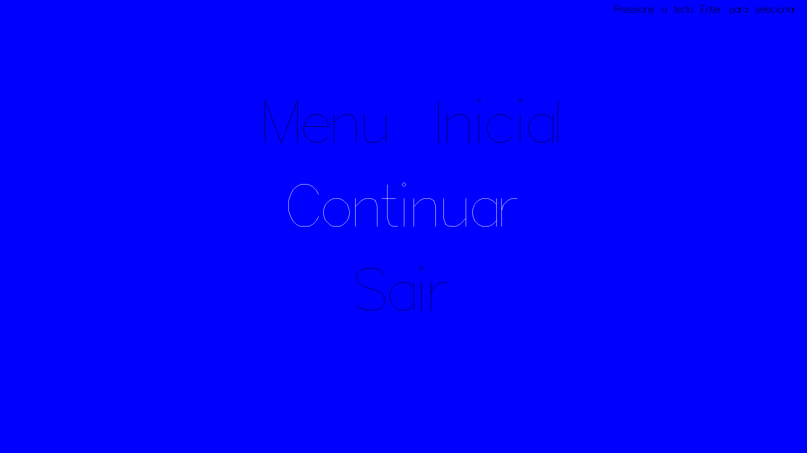
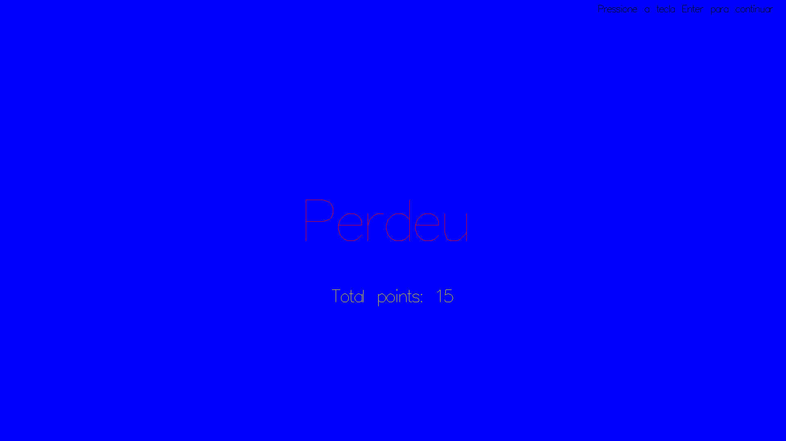

# Crossy Road Light – Haskell Game

## Overview

Crossy Road Light is a game developed in Haskell that recreates the classic "Crossy Road" experience. The project focuses on implementing game logic, simple graphics rendering with BMP files, and event handling using the Gloss library. It serves as a practical demonstration of functional programming applied to 2D games.

## Features

- Player control and movement
- Multiple obstacle types (cars, trees, logs, rivers)
- Menus: Main menu, Pause, Game Over
- Graphics rendered with BMP images
- Event handling and game loop managed by Gloss library

## Screenshots

  
*Main menu screen.*

---


*Gameplay showing player navigating obstacles.*

---


*Pause menu interface.*

---


*Game over screen.*

## How to Run

1. Compile the project using GHC (in the source code folder -> "xxxxxxxx/Crossy_Road-Light/src"):

   ```bash
   ghc -o CrossyRoad Main.hs
   ```

2. Run the game:

   ```bash
   ./CrossyRoad
   ```

## How to Play

- Use the arrow keys to move the player character.  
- Avoid obstacles such as cars and rivers.  
- Cross as many lanes as possible to increase your score.  
- Press 'space' to pause the game.  
- The game ends if the player hits an obstacle.